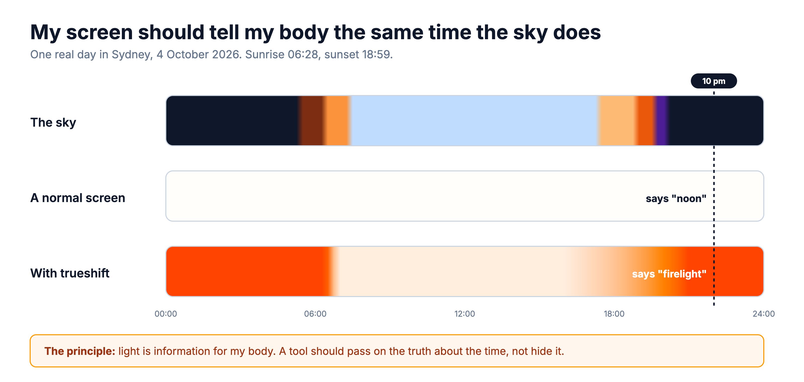
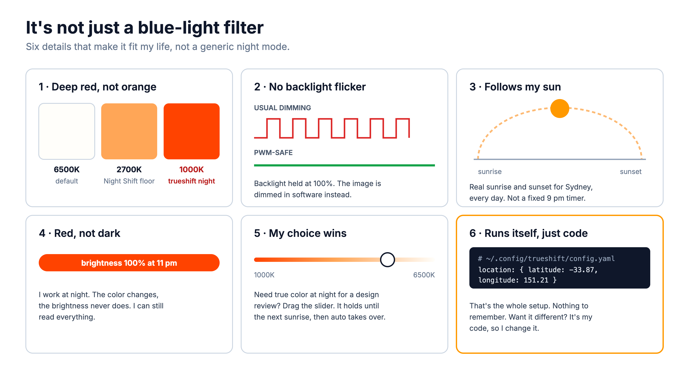
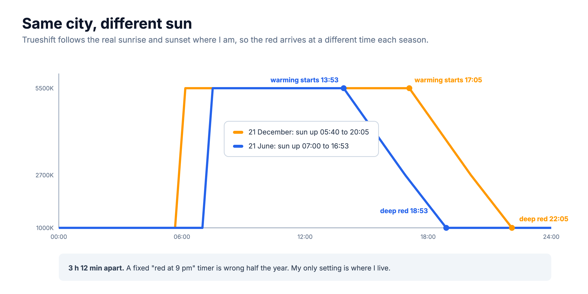
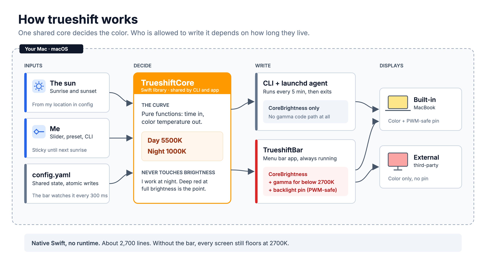
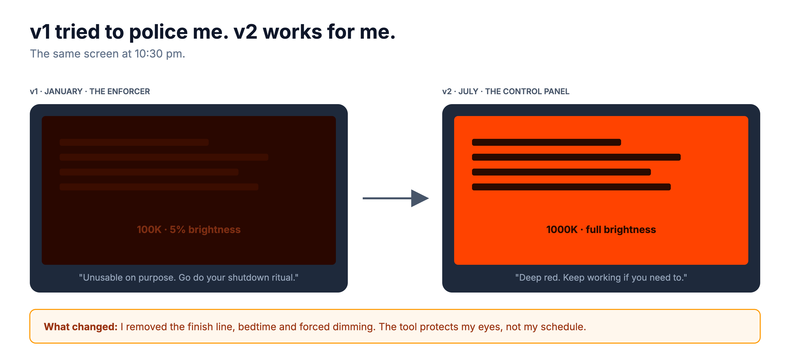
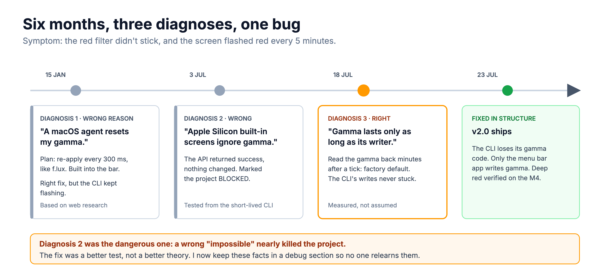
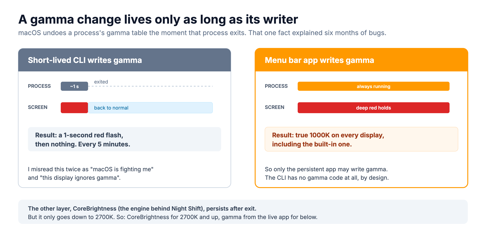
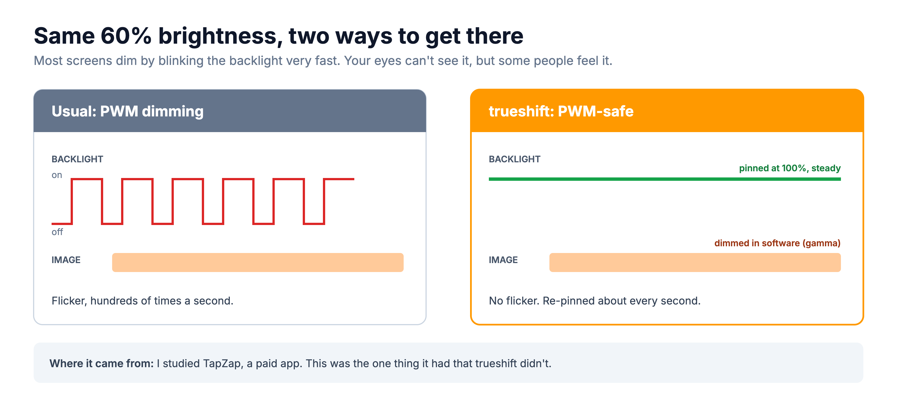

# The trueshift story

How I'd walk an interviewer through trueshift. Written after the fact, from the code, the docs and the git history. (It started as iris, then redshift. Both names were taken, so it became trueshift when I open-sourced it.)

Rules for this doc:
- A `[TBD]` gets filled only with real data, never a guess. A `[confirm: ...]` marks something inferred that I still need to check.
- If the tool changes, update the story the same day.
- First person, plain spoken. Pictures first, words second.

---

## The 30-second version

> Light is information for my body. At 10pm the sky says night, but my screen still says noon. I wanted my screen to tell the truth.
>
> So I built trueshift. It follows the real sun where I live: daylight white in the day, deep firelight red after dark. It's one of the first tools I built for myself that I use every day. It runs quietly in the background. It's just code, so when I want it to work differently, I change it.

---

## Why I built it

Screens show midday light at every hour. My body reads that as "it's still day". Night Shift and f.lux help, but they stop at orange. They also run on a fixed timer, and they belong to someone else.

I wanted three things:
1. **The truth about the time**, matched to the real sky where I am.
2. **No friction.** It should run itself, and I should never have to think about it.
3. **Ownership.** If it's wrong for me, I fix it.

---

## What makes it mine

A blue-light filter is the easy part. The value is in the details that fit my life:
- **Deep red, not orange.** It goes to 1000K, like firelight. Night Shift stops at 2700K.
- **No flicker.** Most screens dim by blinking the backlight. Trueshift can hold the backlight steady and dim in software (more [below](#why-does-flicker-matter)).
- **It follows my sun.** The red arrives with the real sunset in Sydney, not at a fixed hour.
- **Red, not dark.** I work at night, so it never dims the screen. Only the color changes.
- **My choice wins.** If I move the slider, it holds until the next sunrise. Then auto takes over again.
- **Runs itself.** The whole setup is my latitude and longitude.

This is the detail people miss. In June the screen starts warming at 13:53. In December it starts at 17:05. A fixed "red at 9pm" timer would be wrong for half the year.

---

## How it works

- **One core, two front ends.** A Swift library holds the sun curve. The command line tool and the menu bar app both use it, so they always agree.
- **The menu bar app** runs all the time. It re-applies the color every 300 ms and draws the deep red.
- **A background agent** runs every 5 minutes as a safety net. Even if the menu bar app isn't running, the screen still warms to 2700K.
- **One small config file** holds my location and any manual override.

About 2,700 lines of Swift and Objective-C, with 56 unit tests.

---

## The result

- I've used it every day since July 2026, on my MacBook and my external monitor.
- True 1000K deep red on both screens at once, verified on my M4.
- PWM-safe mode, tested live: the backlight held at 100%, a forced change was corrected in 1.2 seconds or less, and turning it off restored my old brightness.

---

## The questions interviewers ask

### "Did you get it right the first time?"

No. I got it wrong twice: once in the product and once in the engineering.

**The product.** v1 (January) was an enforcer. After a "finish line" time, it drove the screen to near-black red so I'd have to stop working. In v2 (July) I removed all of that: no finish line, no bedtime, no dimming. The tool protects my eyes, not my schedule. I work at night and need a readable screen, and I didn't want my own tool adding friction. A tool should serve me, not police me.

**The engineering.** One bug took six months and three diagnoses. The red didn't stick, and the screen flashed red every 5 minutes. In July I even marked the project blocked because I believed my new Mac's screen ignored the color change. It didn't. The real answer was simpler and stranger (next question). What fixed it was a better test, not a better theory.

### "What was technically hard?"

macOS throws away a program's deep-red color change the moment that program exits. My 5-minute background job made the change, exited a second later, and the screen snapped back. That was the red flash.

So I split the work by lifetime. The always-running menu bar app owns the deep red. The short-lived job only uses Apple's Night Shift engine, which survives exit but stops at 2700K. I then removed the deep-red code from the short-lived tool entirely, so the bug can't come back.

### "Why does flicker matter?"

Most screens get dimmer by blinking the backlight hundreds of times a second (PWM). You can't see it, but some people feel it as eye strain or headaches. Trueshift can pin the backlight at 100% and dim the picture in software instead. I found this idea by studying TapZap, a paid app. It was the one thing TapZap had that trueshift didn't, and I built it in a day.

### "What's the weakest part?"

**It uses private Apple APIs.** No public API can do deep red, so I accepted the risk. Any macOS update could break it. If that happens, the background job still gives a 2700K floor.

Two smaller ones:
- **Deep red needs the menu bar app alive.** If it crashes, the screen falls back to orange, not white.
- **I can't measure flicker.** I can prove the backlight holds steady. Proving zero flicker needs a high-speed camera.

### "How do you test it?"

The sun curve is pure logic, with 56 unit tests in CI. My Mac can't run them locally (no full Xcode), so I built hidden check commands: `trueshift curve` prints the whole day, and a script reads back every screen's color table. CI is red on one test right now. I believe the cause is that it assumes Sydney time and the CI server runs in UTC.

### "What would you do next?"

1. Fix that test so CI is green.
2. Rewrite the README. Half of it still describes v1.
3. Ship it as a Homebrew install, now that it's open source.
4. Test PWM-safe on a Studio Display, where the re-pin timing may need to change.

---

## The theme

Technology should serve me, not the other way around. My screen shouldn't lie to my brain about what time it is. And when my own tool started policing me, I changed it to work for me.
